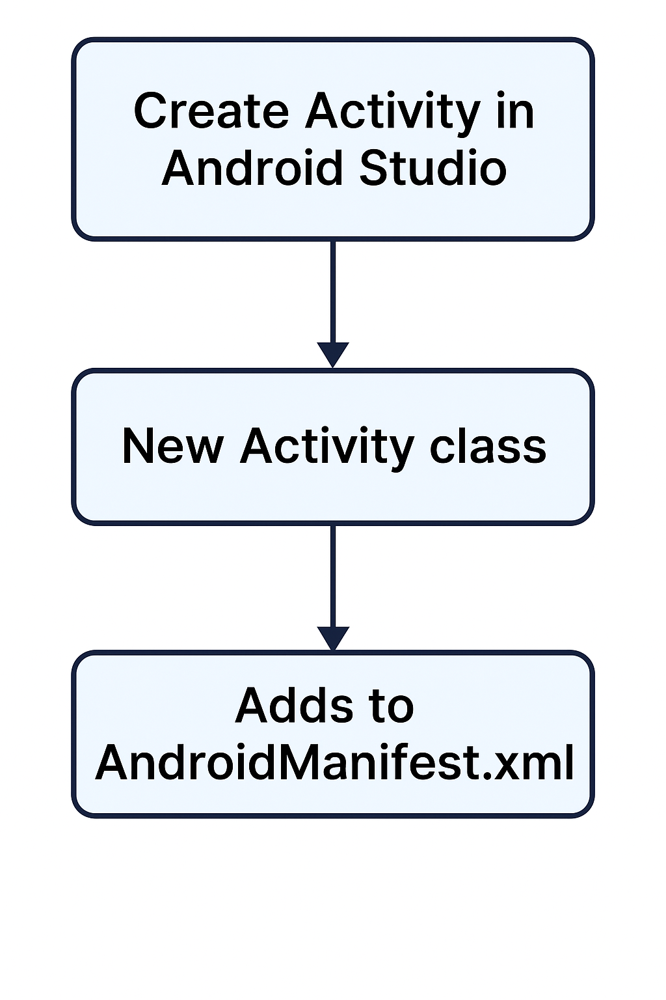

# Criando a Activity



---

## Criando a Activity

Dentro do pacote br.com.alura.orgs, crie a classe MainActivity e faça a extensão de Activity. Em seguida, entre no arquivo AndroidManifest.xml e registre a MainActivity dentro da tag <application>.

Então, configure a MainActivity para que ela seja a principal e launcher do App. Para isso, utilize o <intent-filter> e configure as seguintes tags:

- action: para definir que é a principal
- category: para definir que é launcher

Nesta atividade não há a necessidade de executar o projeto.

### Mudanças com a versão do SDK do Android 31

Se você estiver utilizando o SDK do 31 do Android, é necessário adicionar um atributo a mais caso a Activity tenha uma intent-filter. Basicamente, precisa adicionar o exported e colocar o valor como true:

```kotlin
<activity
    android:name=".MainActivity"
    android:exported="true">
    <intent-filter>
        <action android:name="android.intent.action.MAIN" />
        <category android:name="android.intent.category.LAUNCHER" />
    </intent-filter>
</activity>
```

Em resumo, essa configuração permite com que outras aplicações do Android consigam chamar a nossa Activity, ou seja, caso o valor seja falso, não seremos capazes de executar o App e apresentar a Activity.