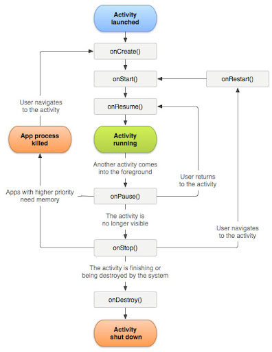

# Introdução à Linguagem Kotlin e Fundamentos do Android

## Kotlin

Kotlin é uma linguagem moderna que roda na **JVM** e é oficialmente suportada para o desenvolvimento de **aplicativos Android**. Combina características de **programação funcional** e **orientada a objetos**, oferecendo maior segurança contra **NullPointerException**, suporte a **corrotinas** para operações assíncronas e uma sintaxe mais concisa que o Java.

## Activity

Uma **Activity** representa uma única tela do aplicativo e é responsável pela interação com o usuário. Cada Activity é uma classe que herda de `AppCompatActivity` ou `Activity`, e segue o **ciclo de vida** gerenciado pelo sistema Android.

### Ciclo de Vida da Activity:

- `onCreate()`: Inicializa a Activity.
- `onStart()`: Torna a Activity visível.
- `onResume()`: A Activity começa a interagir com o usuário.
- `onPause()`: Perde o foco, mas ainda pode ser visível.
- `onStop()`: A Activity não está mais visível.
- `onDestroy()`: A Activity é destruída e removida da memória.



## Layout

O layout define a interface gráfica da aplicação e pode ser criado de duas formas:

1. **XML**: Arquivos localizados em `res/layout` descrevem a hierarquia de elementos visuais.
2. **Jetpack Compose**: Framework declarativo para criar UIs diretamente em Kotlin.

Exemplo de layout XML:
```xml
<LinearLayout xmlns:android="http://schemas.android.com/apk/res/android"
    android:layout_width="match_parent"
    android:layout_height="match_parent"
    android:orientation="vertical">
    
    <TextView
        android:layout_width="wrap_content"
        android:layout_height="wrap_content"
        android:text="Olá, mundo!" />
</LinearLayout>
```

## Views

Uma **View** é qualquer componente visível na tela de um aplicativo, responsável pela interação com o usuário ou pela exibição de dados. Exemplos de Views incluem elementos que exibem texto, botões interativos, imagens e campos para entrada de dados.

### Manipulação de Views em Kotlin

Em Kotlin, as Views são manipuladas por meio de métodos que buscam os componentes definidos na interface e alteram suas propriedades, como o texto exibido ou outras características visuais, de forma dinâmica durante a execução do aplicativo.

```kotlin
class MainActivity : AppCompatActivity() {
    override fun onCreate(savedInstanceState: Bundle?) {
        super.onCreate(savedInstanceState)
        setContentView(R.layout.activity_main)

        // Encontrando o TextView pelo ID e alterando o texto
        val textView: TextView = findViewById(R.id.textView)
        textView.text = "Texto alterado dinamicamente!"
    }
}
```

## AndroidManifest.xml

O **AndroidManifest.xml** é um arquivo essencial em um projeto Android que define as configurações principais do aplicativo. Nele são especificadas:

- As **Activities** que compõem o app.
- As **permissões** necessárias, como acesso à internet ou à câmera.
- Informações básicas como o nome do pacote e dados relevantes sobre o aplicativo.

Exemplo:

```kotlin
<manifest xmlns:android="http://schemas.android.com/apk/res/android"
    package="com.example.meuapp">
    
    <application
        android:allowBackup="true"
        android:theme="@style/Theme.MyApp">
        
        <activity android:name=".MainActivity"
            android:exported="true">
            <intent-filter>
                <action android:name="android.intent.action.MAIN"/>
                <category android:name="android.intent.category.LAUNCHER"/>
            </intent-filter>
        </activity>

    </application>
</manifest>
```

## ViewGroups

Um **ViewGroup** é um contêiner que organiza e agrupa várias Views na interface. Ele define a disposição dos elementos visuais e permite criar hierarquias complexas de componentes. Entre os principais ViewGroups estão aqueles que organizam elementos em linha ou coluna, aqueles que possibilitam posicionamento relativo e os que oferecem flexibilidade para layouts mais complexos.

```xml
<LinearLayout
    android:layout_width="match_parent"
    android:layout_height="match_parent"
    android:orientation="vertical">

    <TextView
        android:layout_width="wrap_content"
        android:layout_height="wrap_content"
        android:text="Exemplo de ViewGroup" />

</LinearLayout>
```

## Construção de Layout

Na construção de layouts para aplicativos Android:

- Todos os elementos visuais são considerados **Views**.
- A organização dos componentes é feita utilizando **ViewGroups**, que servem como contêiner para as Views.
- Cada Activity deve ter apenas uma View raiz, que pode conter outros ViewGroups e Views para formar a estrutura completa da interface.

## O que aprendemos

Nesta aula, foram abordados os seguintes conceitos:

- **Adicionar Views na Activity:** As Activities são responsáveis por exibir o conteúdo visual e recebem as Views por meio do método de criação, onde a interface é definida.
- **Diretórios de recursos do Android:** Além do código-fonte, o projeto organiza imagens, layouts, strings e outros recursos em diretórios específicos, facilitando o gerenciamento e a reutilização.
- **Criar arquivos de layout:** A interface pode ser definida de forma organizada por meio de arquivos de layout, permitindo separar o design do código-fonte.
- **Visualizar o layout no Android Studio:** O ambiente de desenvolvimento permite visualizar o layout de diferentes maneiras, como somente o código, uma combinação de código e preview ou um modo totalmente visual.
- **Editar e carregar layouts nas Activities:** O layout pode ser editado e posteriormente carregado na Activity, integrando os recursos visuais ao código que define a lógica do aplicativo.
- **Teoria da construção de layouts:** A construção de layouts envolve a criação de uma árvore de Views, onde os ViewGroups organizam os componentes individuais.
- **Importância do ViewGroup:** Para que uma hierarquia de Views seja criada de forma organizada, é fundamental utilizar ViewGroups, já que uma View isolada não pode conter outras Views.