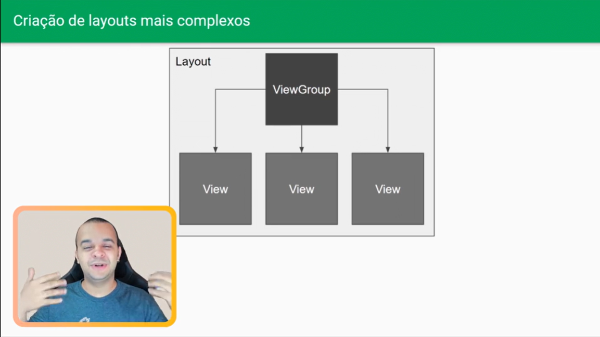

## Implementando Activity

### Introdução
- No desenvolvimento Android, não há um método `main`, mas sim uma Activity que serve como ponto de entrada para o aplicativo.
- Uma Activity possui duas funções principais:
  - **View:** Responsável pelo layout e apresentação da interface para o usuário.
  - **Lógica:** Contém a programação que define o comportamento do aplicativo.

### Criando a Activity
- No ambiente de desenvolvimento, acesse a pasta Java dentro do pacote de produção.
- Utilize o atalho (por exemplo, ALT + INSERT) para criar uma nova classe e nomeie-a como "MainActivity".
- Implemente a classe fazendo-a herdar de Activity (ou de uma classe derivada, como AppCompatActivity) e importe as classes necessárias.

### Configurando o AndroidManifest.xml
- O arquivo AndroidManifest.xml é essencial para registrar as Activities, definir ícones, o nome do aplicativo e outras configurações.
- Dentro da tag `<application>`, registre a MainActivity com um intent-filter que especifique a ação MAIN e a categoria LAUNCHER, indicando que ela é o ponto de entrada do aplicativo.

### Testando a Inicialização do App
- A Activity possui um ciclo de vida que determina os momentos de criação, exibição e destruição.
- Na MainActivity, no método `onCreate()`, é possível inserir comportamentos de teste, como exibir uma mensagem de boas-vindas (por exemplo, utilizando um Toast).

### Adicionando Views na Activity
- Em vez de exibir apenas mensagens, é possível criar uma View e definir essa View como o conteúdo principal da Activity por meio do método `setContentView()`.
- Para comportamentos específicos, por exemplo, exibir um texto, pode-se utilizar uma TextView e ajustar suas propriedades (como o texto) de forma programática.

### Organização do Layout em Arquivo Exclusivo
- Todo o código e as Views podem ser organizados em arquivos separados, que serão carregados na Activity.
- Os diretórios de recursos do Android ajudam na organização:
  - **drawable:** Armazena imagens.
  - **mipmap:** Contém versões de ícones em diferentes resoluções.
  - **values:** Define cores e outros valores fixos.
  - **strings:** Armazena textos imutáveis.
  - **themes:** Define o tema padrão e o tema escuro do aplicativo.

### Criando o Layout da Activity
- Utilize os recursos do Android Studio para criar um arquivo de layout:
  - Crie um novo diretório de recurso para layouts, se necessário.
  - Em seguida, crie um arquivo de layout (normalmente nomeado como `activity_main`) que defina a estrutura visual, começando por um elemento raiz.

### Estilizando o Layout
- O layout pode ser estilizado tanto por meio de uma interface visual (arrastar e soltar componentes) quanto editando as propriedades dos componentes diretamente.
- Para carregar o layout criado, na Activity utilize o método `setContentView()` referenciando o arquivo de layout.

### Evoluindo com o Layout
- Todos os componentes visuais são considerados Views, mas apenas um elemento pode servir como raiz do layout.
- Para que um componente possa conter outras Views, é necessário que ele seja um ViewGroup (como o ConstraintLayout, por exemplo).
- O posicionamento dos componentes pode ser ajustado definindo regras e constraints para evitar que elementos fiquem desalinhados, como ficar presos no topo sem espaçamento.

### Implementando Namespaces no Layout
- O namespace **app** é utilizado para definir atributos específicos dos componentes (por exemplo, constraints).
- O namespace **tools** permite a definição de atributos que são visíveis apenas no preview, sem afetar a execução do aplicativo.

### Propriedades de Layout
- **match_parent:** Define que a View deve ocupar todo o espaço disponível do seu elemento pai.
- **wrap_content:** Ajusta a View ao tamanho de seu conteúdo.
- O uso de constraints (por exemplo, definir que uma View deve ficar abaixo de outra) garante um posicionamento adequado dos componentes.
- A gestão de IDs dos componentes facilita a manutenção e refatoração do código, com ferramentas que atualizam os IDs automaticamente.

### Aplicando Margens e Tamanhos de Texto
- Para definir margens de forma escalável entre diferentes dispositivos, utilize a unidade **DP** (densidade de pixels), que ajusta o tamanho conforme a densidade da tela.
- Para o tamanho dos textos, utilize a unidade **SP** (scale-independent pixels), que é semelhante ao DP, mas também considera as configurações de acessibilidade, garantindo que o texto seja dimensionado de acordo com as preferências do usuário.
