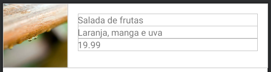
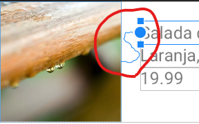
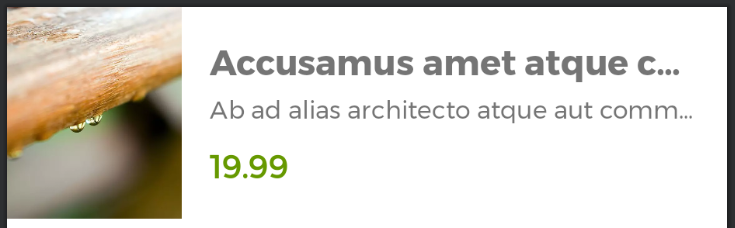

## Utilizando a ImageView no layout do produto

Adicione uma ImageView no layout do produto e configure o layout para apresentar o seguinte aspecto visual no preview:

Layout do item do produto com a ImageView à esquerda e o conteúdo em texto do produto à direita

Ao adicionar a ImageView, considere o uso de algum sample data de imagem para apresentar uma imagem no preview. Em vídeo, foi utilizado o @tools:sample/backgrounds/scenic.

O grande detalhe desta implementação é modificar a constraint endToStart da ImageView com um dos TextViews, por exemplo, o de nome. Após escolher o TextView para configurar a constraint, modifique a constraint startToEnd do TextView escolhido para se ajustar à ImageView. Ao realizar esse ajuste, o preview deve apresentar essa ligação entre a ImageView e TextView:

Essa característica visual é conhecida como Chain no ConstraintLayout. Chains são criadas cada vez que Views, dentro do ConstraintLayout, são ligadas no mesmo eixo de maneira bidirecional, como o fim da ImageView no início do TextView e o início do TextView no fim do ImageView.

Após fazer esse ajuste, defina a largura e altura da ImageView com o valor 100dp e configure o tipo de escala com o valor centerCrop para preencher o container da ImageView com a imagem.

Por fim, defina um valor na propriedade app:srcCompat para apresentar um conteúdo na ImageView antes de testar o app. Caso você não tenha um drawable de amostra, como foi apresentado em vídeo, pode aplicar recursos do Android, como é o caso de cores, usando a @android:color/holo_purple.

Após aplicar todos os ajustes, rode o app e salve um produto. Então, confira se apresenta a ImageView no design de um item de produto.

### Para saber mais: Chains do ConstraintLayout

Durante a atividade para adicionar a ImageView, foi apresentada a técnica de Chain no ConstraintLayout. Além de permitir uma flexibilidade de alinhamento entre as Views, Chains possuem alguns comportamentos específicos que podem ser úteis na construção de layout, por exemplo, a distribuição proporcional entre as Views configuradas em Chain. Para mais detalhes sobre Chains e suas possibilidades, você pode conferir a [documentação.](https://developer.android.com/training/constraint-layout#constrain-chain)

## Faça como eu fiz: Adicionando imagens no projeto

Adicione uma imagem que representa um produto no projeto Android. Para isso, adicione imagens alternativas para diferentes densidades de telas. Caso você tenha habilidades com edição de imagem, você pode usar a documentação como um suporte para ajustar a imagem desejada com as medidas necessárias.

Caso contrário, você pode usar algum aplicativo alternativo que faça esse ajuste automaticamente, como o [NativeScript Image Builder](https://nsimage.brosteins.com/) (usado no vídeo) ou, se preferir, pode baixar as imagens.

Para adicionar as imagens no projeto, você precisa copiar todas as imagens (que estão dentro dos diretórios de drawable com os DPIs diferentes) e colar em res. O Android Studio deve apresentar uma mensagem indicando onde vai colocar as imagens, então, certifique-se de que serão colocadas em res e clique em “ok”. A partir desse momento, as imagens estarão acessíveis a partir de res/drawable.

Por fim, modifique a propriedade app:srcCompat da ImageView do item de produto e confira se, ao testar, o app apresenta a imagem esperada após a criação de um produto.

A partir desta atividade, salve um produto no DAO de produtos para facilitar o teste do visual dos produtos em lista.

## Faça como eu fiz: Configurando fontes no projeto

Adicione as fontes Montserrat Regular e Bold. Para isso você pode considerar duas opções:

Utilizar o editor visual e filtrar por fontFamily > clicar no combobox e escolher a opção More Fonts...
Clicar na aba Resource Manager > acessar a aba Font > clicar no ícone de cruz > More Fonts...
Seguindo um desses procedimentos deve dar acesso à janela para adicionar fontes, então, filtre por Montserrat e selecione a fonte.

Como primeira adição, escolha o preview com o valor Regular, mantenha o nome da fonte como montserrat e a criação de uma fonte baixável (Create downloadable font), por fim, clique em OK. Faça o mesmo procedimento e adicione a versão Bold da Montserrat. Além do preview, a diferença é que o nome dessa fonte será montserrat_bold.

Após adicionar a fonte, modifique a propriedade android:fontFamily do nome do produto para usar a fonte montserrat, então, aplique também um tamanho do texto (android:textSize) de 20sp e um estilo de texto (android:textStyle) negrito (bold).

## Faça como eu fiz: Ajustando informações do produto

Modifique as demais informações do item do produto conforme a proposta de implementação. Para isso, faça:

Ajuste das fontes da descrição e valor para que sejam montserrat
Modifique o tamanho e o estilo de texto:
Descrição 14sp
Valor 18sp com negrito
Adicione reticências (android:ellipsize) no nome e na descrição no final (end) do texto
Limite a quantidade de linhas do nome e da descrição para o máximo de 1 linha
Aplique margem no valor, 8dp no topo e 16dp em baixo
Modifique a cor do valor para que seja verde (você pode usar @android:color/holo_green_dark)
Ajustes a altura da ImageView para fazer match_constraint (0dp), então, configure o eixo y (top e bottom) com o pai
Após aplicar as mudanças, também considere o uso do lorem ipsum com o sample data @tools:sample/lorem/random para testar, via preview, a reticência com um conteúdo extenso. Com todos os ajustes aplicados, o preview deve apresentar o seguinte resultado:

Por fim, rode o app e insira um produto com nome e descrição com texto o suficiente para ultrapassar mais de uma linha de conteúdo. Então, verifique se apresenta o comportamento esperado.

## O que aprendemos?

Nesta aula, aprendemos:

Adicionar imagens com ImageView
Além de Views que lidam com texto (TextView ou EditText), o framework do Android oferece a ImageView que lida com conteúdos drawables ou cores.
Oferecer drawables alternativos
Ao oferecer um drawable para um projeto Android, como é o caso de uma imagem em png. O recomendado é oferecer diferentes versões da mesma imagem para dar um suporte melhor para diferentes DPIs.
Configurar e utilizar fontes no projeto
Além de utilizar as fontes padrão de um projeto Android, também temos a capacidade de utilizar fontes diferentes na personalização de apps, sejam fontes adicionadas diretamente no projeto ou baixáveis.
Utilizar sample data em imagens e texto
Ao construir layouts, podemos utilizar conteúdo exclusivo do preview do Android Studio, o sample data. A partir dele, temos a capacidade de reutilizar conteúdos de texto ou imagens para simular um conteúdo real, como é o caso de avatares, cenas ou até mesmo textos aleatórios com lorem ipsum.