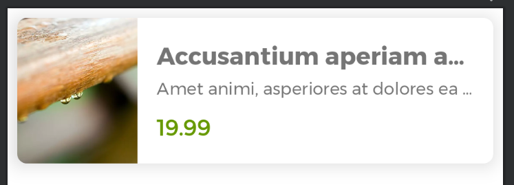
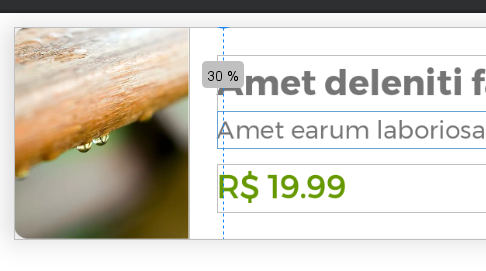

## Faça como eu fiz: Personalizando produto com Card

Modifique o container do item do produto para utilizar Cards. Para isso, utilize a MaterialCardView.

Você pode usar a documentação do material.io como apoio. Neste exercício não é necessário criar o drawable personalizado o ConstraintLayout.

Após envolver todo o conteúdo com o Card, adicione também:

Elevação de 8dp
Raio nos cantos de 8dp
Margem de 8dp

Com os ajustes feitos, o preview deve apresentar o seguinte aspecto visual:

Preview do item do produto com o conteúdo envolvido em um Card com elevação, cantos arredondados e margem.

Após aplicar todos os ajustes, execute o app e confira se apresenta o resultado visual esperado.

## Faça como eu fiz: Formatando moeda para real

Ajuste o código do ViewHolder do ListaProdutosAdapter. para que ele formate o valor do produto em reais. Para isso, você pode utilizar a API do Java NumberFormat. A partir dela, utilize o método estático getCurrencyInstance() e envie uma instância de Locale() com a configuração de língua portuguesa e país Brasil, então, atribua o retorno de getCurrencyInstance() para uma variável, por exemplo, a formatador.

A partir da variável criada, chame o método format() enviando o valor do produto como argumento, e então, atribua o retorno do format() para uma variável que vai representar o valor formatado e atribue essa variável para a property text do EditText do valor.

Por fim, extraia o código para um método que recebe um BigDecimal (valor do produto) e retorne a String que representa o valor formatado para a moeda brasileira, e então, rode o App e confira se apresenta o valor formatado como esperado. Durante o teste, adicione um produto novo com um valor alto, por exemplo, 10 casas ou mais, para verificar se apresenta a formatação esperada.

## Faça como eu fiz: Implementando o Guideline no layout

Adicione a Guideline no layout do item de produto para ajustar a largura da ImageView com 30% do container (ConstraintLayout). Para isso adicione os seguintes atributos para a Guideline:

android:orientation com valor vertical
app:layout_constraintGuide_percent com valor 0.3
Lembre-se de adicionar um id no Guideline para ajustar as constraints

Com esse ajuste, deve apresentar a Guideline no preview:

Após modificar a Guideline, ajuste a constraint de fim da ImageView para o ínicio da Guideline, então, teste o App e confira se apresenta o comportamento esperado.

Você pode usar o Layout Validation para verificar se funciona como esperado.

## O finish

### 2. O que acontece quando você chama finish()?

Sim, ao clicar no ícone e chamar finish(), você está apenas encerrando a Activity atual. Mas o que isso significa "por baixo dos panos"?

Explicando:

O Android trabalha com uma pilha de Activities, chamada de Back Stack.

Quando você abre uma nova Activity (ex: FormProdutoActivity), ela é empilhada em cima da anterior (ListaProdutoActivity).

Ao chamar finish():

O Android remove a Activity atual do topo da pilha.

E a Activity anterior automaticamente volta a ser exibida, sem precisar ser recriada (a não ser que tenha sido destruída por falta de memória).

Em termos práticos:

ANTES:

[ListaProdutoActivity] <- já estava aberta
[FormProdutoActivity]  <- aberta por cima

DEPOIS DE finish():

[ListaProdutoActivity] <- visível novamente
Alternativa: onBackPressedDispatcher.onBackPressed()
Outra forma de simular exatamente o comportamento do botão "voltar" físico é:

onBackPressedDispatcher.onBackPressed()
Mas, como finish() faz isso para a maioria dos casos, você está bem servido com ele.