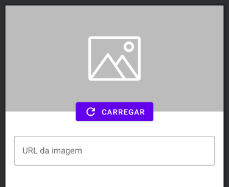

## Faça como eu fiz: Modificando o formulário

Ajuste o layout do formulário de produto para que atenda à proposta de implementação. Para isso, aplique os seguintes ajustes:

Adicione a ImageView no topo com 200dp de altura e o tipo de escala centerCrop
Utilize o TextInputLayout em vez do EditText nos campos de nome, descrição e valor
Ajuste o TextInputLayout para utilizar o estilo Outlined
Como apoio, você pode consultar a página do material.io que descreve mais detalhes do Text field (TextInputLayout).

Após fazer os ajustes, o preview deve apresentar um resultado similar a este:

Preview do layout de formulário de produto com a ImageView e TextInputLayouts implementados

Fique à vontade para usar uma imagem do produto de sua preferência.

Depois de aplicar todos os ajustes, rode o app e confira se apresenta o resultado esperado.

## Faça como eu fiz: Criando o dialog (caixa de diálogo)

Crie e apresente uma caixa de diálogo no app. Para isso, no onCreate() da ListaProdutosActivity, crie a instância de AlertDialog.Builder() e insira um título, mensagem, botão de confirmar e cancelar.

Após fazer os ajustes, rode o app e confira se apresenta o dialog (caixa de diálogo) como esperado.

## Faça como eu fiz: Adicionando o layout no dialog

Migre o código do dialog para que seja apresentado ao clicar na imagem do formulário de produto. Após fazer o ajuste, remova a configuração de título e mensagem do AlertDialog.Builder() e configure o método setView() como chamada encadeada do AlertBuild().

Na configuração, envie como argumento o layout R.layout.formulario_imagem. Considerando que o layout não foi criado, utilize o Android Studio para auxiliá-lo na criação do layout (você pode usar o atalho Alt + Enter para apresentar as opções de criação).

Em seguida, implemente o layout para obter o seguinte resultado visual no preview:

Preview do layout de formulário de imagem com a ImageView no topo, botão de carregar centralizado com a constraint bottom da ImageView e TextInputLayout no final do layout com a dica 'URL da imagem'

Se preferir, você pode baixar a imagem [padrão](https://github.com/alura-cursos/android-com-kotlin-personalizando-ui/archive/refs/heads/resources-imagem-padrao.zip) ou, então, utilizar uma de sua preferência.

A implementação deste layout utiliza técnicas similares às que foram vistas nos demais layouts, a diferença é que, a partir deste layout, o botão está configurado nas constraints do eixo y (top e bottom) na constraint bottom da ImageView.

Além disso, é adicionado um ícone no botão a partir da propriedade app:icon.

Lembre-se de adicionar o ícone de carregar a imagem com o Android Studio. O nome do ícone é refresh.

Aproveite esta atividade para verificar alguns detalhes de implementação, como o tipo de entrada específico para cada TextInputEditText, padronizar IDs etc. Após finalizar todos os ajustes, rode o app, acesse o formulário de produto, clique na imagem e, então, confira se apresenta o dialog conforme o esperado.

## Para saber mais

Além da AlertDialog, via SDK do Android, também temos acesso a outros tipos de dialogs, seja o DateTimePickerDialog ou TimePickerDialog. Porém, existem outras possibilidades de dialogs mais poderosos e personalizados, como o [MaterialDatePicker](https://material.io/components/date-pickers). Se você tiver interesse, leia um artigo que apresenta um tutorial de como implementar o MaterialDatePicker no seu app.

## O que aprendemos

Nesta aula, aprendemos:

Utilizar o componente TextInputLayout
Além do FAB e card, também aprendemos a utilizar o TextInputLayout, um componente que personaliza o EditText com o padrão do Material Design.
O que são caixa de diálogo
Além do layout da Activity, também temos a capacidade de utilizar dialogs para apresentar conteúdo visual. A partir deles, podemos direcionar o usuário para tomar uma decisão ou adicionar informações a mais.
Criar caixa de diálogo com o AlertDialog.Builder()
Temos acesso à classe base Dialog para criar caixas de diálogo, porém, a própria documentação sugere o uso de implementações para facilitar a criação do Dialog. Entre as possibilidades, podemos utilizar a AlertDialog que, além de oferecer recursos padrões como título, mensagem, botões de positivos ou negativos, também permite adicionar um layout personalizado.
Personalizar o layout de um dialog
Ao utilizar a AlertDialog temos a capacidade de personalizar dialogs, seja reutilizando um layout pronto, seja criando um layout novo exclusivo para o dialog.

