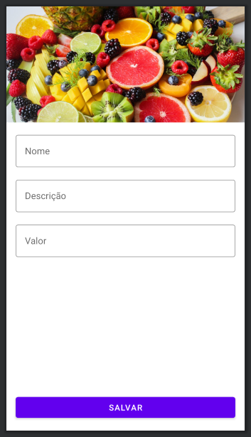

## Faça como eu fiz: Modificando o formulário

Ajuste o layout do formulário de produto para que atenda à proposta de implementação. Para isso, aplique os seguintes ajustes:

Adicione a ImageView no topo com 200dp de altura e o tipo de escala centerCrop
Utilize o TextInputLayout em vez do EditText nos campos de nome, descrição e valor
Ajuste o TextInputLayout para utilizar o estilo Outlined
Como apoio, você pode consultar a página do material.io que descreve mais detalhes do Text field (TextInputLayout).

Após fazer os ajustes, o preview deve apresentar um resultado similar a este:

Preview do layout de formulário de produto com a ImageView e TextInputLayouts implementados

Fique à vontade para usar uma imagem do produto de sua preferência.

Depois de aplicar todos os ajustes, rode o app e confira se apresenta o resultado esperado.

## Faça como eu fiz: Criando o dialog (caixa de diálogo)

Crie e apresente uma caixa de diálogo no app. Para isso, no onCreate() da ListaProdutosActivity, crie a instância de AlertDialog.Builder() e insira um título, mensagem, botão de confirmar e cancelar.

Após fazer os ajustes, rode o app e confira se apresenta o dialog (caixa de diálogo) como esperado.

