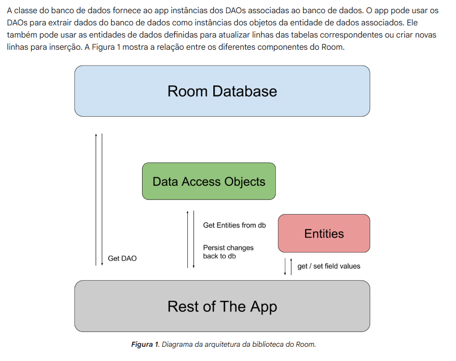

O android não consegue manter as alterações salvas ao fechar/abrir o app.

Armazenamento especifico: arquivos que somente o aplicativo acessa.

Armazenamento compartilhado: outros aplicativos conseguem acessar

Preferencias: armazena apenas tipos primitivos em pares de chave-valor

Banco de dados: só o app tem acesso e temos acesso usando a persistencia Room

--

Neste caso vamos usar o banco de dados com a [biblioteca Room](https://developer.android.com/training/data-storage/room)

